# Covoiturage Project Architecture Guide

This document explains the project in detail: what it does, how the frontend talks to the backend, how backend services connect to each other, how data reaches the database, and how object-oriented programming and SOLID principles appear in the codebase.

The application is a carpooling platform named **Same Trip / Same Trip**. Users can register as passengers or drivers, search trips, create trips, reserve seats, simulate payments, receive in-app notifications, and manage accounts from an admin area.

## 1. Technical Overview

| Area | Technology / Pattern |
| --- | --- |
| Language | Java 17 |
| Web backend | Jakarta Servlet API 5 |
| Packaging | Maven WAR |
| Runtime | Apache Tomcat 10 |
| Frontend | Static HTML, CSS, vanilla JavaScript |
| Persistence | JDBC with `PreparedStatement` |
| Database | H2 embedded file database, `./covoiturage_db` |
| Session management | `HttpSession` stored by Tomcat |
| Tests | JUnit 5 |

The project deliberately avoids Spring, Hibernate, frontend frameworks, and JSON libraries. Most JSON is built manually inside servlets.

## 2. Folder Structure

```text
.
|-- pom.xml
|-- schema.sql
|-- start.cmd
|-- test_api.ps1
|-- src
|   |-- main
|   |   |-- java/com/covoiturage
|   |   |   |-- dao
|   |   |   |-- exception
|   |   |   |-- model
|   |   |   |-- service
|   |   |   |-- servlet
|   |   |   `-- util
|   |   `-- webapp
|   |       |-- css
|   |       |-- js
|   |       |-- views
|   |       `-- WEB-INF
|   `-- test
|       `-- java/com/covoiturage/service
`-- target
```

Important folders:

| Folder | Responsibility |
| --- | --- |
| `src/main/webapp` | Browser-facing HTML, CSS, and JavaScript. |
| `src/main/java/com/covoiturage/servlet` | HTTP endpoints. Each servlet reads request parameters, checks session access, calls services, and returns HTML or JSON. |
| `src/main/java/com/covoiturage/service` | Business logic: authentication, trips, reservations, payments, notifications. |
| `src/main/java/com/covoiturage/dao` | Database access using JDBC. |
| `src/main/java/com/covoiturage/model` | Domain objects: `Utilisateur`, `Trajet`, `Reservation`, `Paiement`, etc. |
| `src/main/java/com/covoiturage/util` | Infrastructure helpers such as database initialization and password hashing. |

## 3. High-Level Architecture

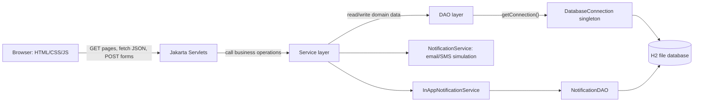

The application follows a classic layered structure:

1. The browser loads static pages and JavaScript.
2. JavaScript calls servlet endpoints with `fetch()` or submits HTML forms.
3. Servlets validate the HTTP request and session.
4. Servlets call service classes.
5. Services enforce business rules and coordinate other services.
6. DAOs execute SQL and map rows to model objects.
7. The H2 database stores durable state.
8. The servlet returns HTML redirects or JSON responses.

## 4. Main Domain Model

### Users

`Utilisateur` is an abstract base class. It contains shared user data:

- `id`
- `nom`
- `prenom`
- `email`
- `motDePasseHash`
- `telephone`
- `statutCompte`
- `dateInscription`
- `derniereConnexion`

Concrete subclasses define the real role:

| Class | Role | Extra behavior |
| --- | --- | --- |
| `Passager` | `PASSAGER` | Keeps a defensive-copy list of reservations. |
| `Chauffeur` | `CHAUFFEUR` | Keeps proposed trips, average rating, number of reviews. |
| `Admin` | `ADMIN` | Used for admin-only account operations. |

### Trips

`Trajet` represents a proposed carpool trip:

- departure city
- arrival city
- departure date/time
- total seats
- available seats
- price per seat
- status: `OUVERT`, `COMPLET`, `ANNULE`, `TERMINE`
- driver
- vehicle description

Important business behavior:

- `reserverPlace()` decreases available seats and marks the trip `COMPLET` when no seats remain.
- `libererPlace()` increases available seats and can move the trip back to `OUVERT`.
- `peutAnnulerSansPenalite()` checks whether there are confirmed reservations.

### Reservations

`Reservation` connects a passenger to a trip:

- trip
- passenger
- number of seats
- total amount
- status: `EN_ATTENTE`, `CONFIRMEE`, `ANNULEE`, `REMBOURSEE`
- reservation date
- cancellation date
- refunded amount
- payment transaction reference
- passenger rating for the driver

Important business behavior:

- `confirmer()` moves a reservation from `EN_ATTENTE` to `CONFIRMEE`.
- `annuler()` calculates refund information and moves it to `ANNULEE`.
- `marquerCommeRemboursee()` moves an already cancelled reservation to `REMBOURSEE`.

### Payments

`Paiement` represents a simulated payment:

- reservation
- amount
- refunded amount
- status: `AUTORISE`, `CAPTURE`, `REMBOURSE`, `ECHOUE`, `ANNULE`
- method: `CARTE_BANCAIRE`, `PAYPAL`, `VIREMENT`
- external reference
- authorization/capture/refund dates

The payment lifecycle is intended to be:

```text
AUTORISE -> CAPTURE -> REMBOURSE
```

In this demo project, real external payment providers are simulated by logs and generated references.

### Notifications

There are two notification mechanisms:

| Service | Purpose |
| --- | --- |
| `NotificationService` | Simulates email and SMS output by logging to console. |
| `InAppNotificationService` | Persists notifications in the `notifications` table. |

## 5. Database Schema and Relationships

The schema is initialized automatically by `DatabaseInitializer`, a `ServletContextListener` annotated with `@WebListener`. When Tomcat starts the application, it creates tables if they do not exist and inserts demo data when needed.

Main tables:

| Table | Purpose | Main relationships |
| --- | --- | --- |
| `utilisateurs` | Stores passengers, drivers, and admins. | Referenced by `trajets`, `reservations`, `notifications`, `app_ratings`. |
| `trajets` | Stores carpool trips. | `chauffeur_id -> utilisateurs.id`. |
| `reservations` | Stores passenger reservations. | `trajet_id -> trajets.id`, `passager_id -> utilisateurs.id`. |
| `paiements` | Stores simulated payment records. | `reservation_id -> reservations.id`. |
| `notifications` | Stores in-app notifications. | `utilisateur_id -> utilisateurs.id`. |
| `app_ratings` | Stores one app rating per user. | `utilisateur_id -> utilisateurs.id`. |

Relationship diagram:

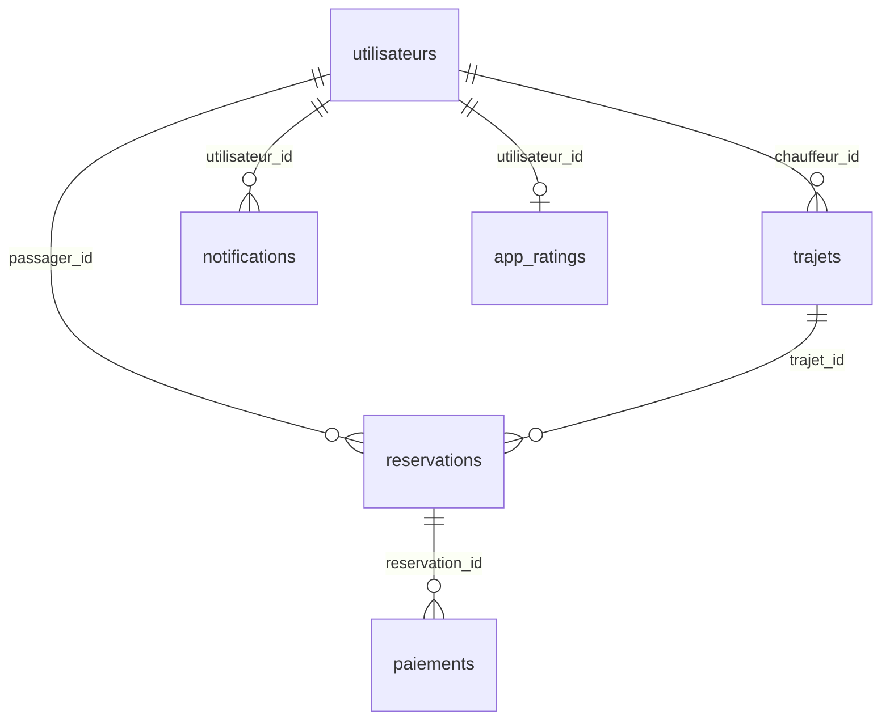

## 6. Backend Layers in Detail

### 6.1 Servlet Layer

Servlets are the HTTP boundary of the backend. They know about:

- request paths
- request parameters
- HTTP status codes
- redirects and forwards
- session access
- manual JSON serialization

They should not contain complex business rules. Instead, they delegate to services.

Main servlets:

| Servlet | Endpoints | Responsibility |
| --- | --- | --- |
| `LoginServlet` | `/login`, `/logout` | Login, logout, session creation/invalidation. |
| `InscriptionServlet` | `/inscription` | Registration page and account creation. |
| `SessionServlet` | `/session/me` | Returns current connected user as JSON. |
| `TrajetServlet` | `/trajets`, `/trajets/mes`, `/trajets/nouveau`, `/trajets/annuler` | Trip search/listing, driver trip creation, driver trip cancellation. |
| `ReservationServlet` | `/reservation/*` | Reservation creation, listing, confirmation, cancellation, deletion, driver rating. |
| `PaiementServlet` | `/paiement` | Payment page and direct payment simulation. |
| `NotificationServlet` | `/notifications/*` | In-app notification page, list, mark read, delete. |
| `AdminServlet` | `/admin/*` | Admin user listing, suspension, blocking, reactivation. |
| `AppRatingServlet` | `/app/notation` | Saves a rating for the app. |

### 6.2 Service Layer

Services contain business use cases. They coordinate DAOs and other services.

| Service | Main dependencies | Responsibility |
| --- | --- | --- |
| `AuthService` | `UtilisateurDAO` | Create accounts, authenticate users, update account status, list users. |
| `TrajetService` | `TrajetDAO`, `ReservationDAO`, `PaiementService`, `NotificationService`, `InAppNotificationService` | Create trips, search trips, manage seats, cancel trips, notify passengers. |
| `ReservationService` | `ReservationDAO`, `TrajetService`, `PaiementService`, `NotificationService`, `InAppNotificationService` | Create reservations, confirm reservations, cancel/refund reservations, list reservations, rate drivers. |
| `PaiementService` | `PaiementDAO` | Authorize, capture, refund, and directly pay simulated payments. |
| `NotificationService` | none | Simulate email and SMS notifications. |
| `InAppNotificationService` | `NotificationDAO` | Store, list, read, and delete in-app notifications. |

### 6.3 DAO Layer

DAOs isolate SQL from business logic. Each DAO opens connections through `DatabaseConnection.getInstance().getConnection()` and uses `PreparedStatement`.

| DAO | Table(s) touched |
| --- | --- |
| `UtilisateurDAO` | `utilisateurs` |
| `TrajetDAO` | `trajets`, joined with `utilisateurs` |
| `ReservationDAO` | `reservations`, joined with `trajets` and `utilisateurs`; deletes related `paiements` for old reservation deletion |
| `PaiementDAO` | `paiements` |
| `NotificationDAO` | `notifications` |
| `AppRatingDAO` | `app_ratings` |

### 6.4 Utility Layer

| Class | Responsibility |
| --- | --- |
| `DatabaseConnection` | Singleton-style JDBC connection provider for the H2 database. |
| `DatabaseInitializer` | Creates schema and demo data on application startup. |
| `PasswordUtils` | Hashes and verifies passwords using salted SHA-256, with legacy SHA-256 hex support. |

## 7. Frontend Pages and Their Backend Calls

### Home Page

`index.html` is the landing page. It links to:

- `/trajets`
- `/login`
- `/inscription`

### Login Page

`views/login.html` submits a classic HTML form:

```text
POST /login
```

The servlet creates an `HttpSession` on success and redirects:

- admins go to `/admin/users`
- other users go to `/trajets`

### Registration Page

`views/inscription.html` submits:

```text
POST /inscription
```

`js/inscription.js` validates the form in the browser before submission:

- required fields
- password length
- password confirmation
- selected role

The backend still validates again in `InscriptionServlet` and `AuthService`.

### Trips Page

`views/trajets.html` loads `js/trajets.js`.

On page load:

```text
GET /session/me
GET /trajets with Accept: application/json
GET /notifications/mes?format=json
```

When searching:

```text
GET /trajets?depart=...&arrivee=...&date=...&places=...
```

When a driver creates a trip:

```text
POST /trajets/nouveau
Content-Type: application/x-www-form-urlencoded

villeDepart=...
villeArrivee=...
dateHeureDepart=...
placesTotal=...
prixParPlace=...
descriptionVehicule=...
```

When a passenger reserves:

```text
POST /reservation/creer
Content-Type: application/x-www-form-urlencoded

trajetId=...
nombrePlaces=...
methodePaiement=...
```

### Passenger Reservations Page

`views/reservations.html` fetches passenger reservations:

```text
GET /reservation/mes?format=json
```

It also calls:

```text
POST /reservation/annuler
POST /reservation/supprimer
POST /reservation/noter
POST /app/notation
```

### Driver Trips Page

`views/mes-trajets.html` loads:

```text
GET /trajets/mes?format=json
GET /reservation/chauffeur?format=json
```

It allows the driver to:

```text
POST /reservation/confirmer
POST /trajets/annuler
```

### Payment Page

`views/paiement.html` loads the reservation recap using:

```text
GET /reservation/mes?format=json
```

It submits simulated payment data to:

```text
POST /paiement
```

Note: reservation creation already calls `PaiementService.autoriser(...)`, so a reservation has an authorization reference before the payment page. The payment page then calls `PaiementService.payer(...)`, which performs another simulated authorization plus capture. In a production design, this should usually be unified into one payment flow.

### Notifications Page

`views/notifications.html` uses:

```text
GET /notifications/mes?format=json
POST /notifications/lu
POST /notifications/lu-tout
POST /notifications/supprimer
```

### Admin Pages

`views/admin.html` and `views/admin-bloques.html` use:

```text
GET /admin/users?format=json
GET /admin/bloques?format=json
POST /admin/suspendre
POST /admin/bloquer
POST /admin/reactiver
```

Admin access is enforced by checking whether the connected session user is an instance of `Admin`.

## 8. End-to-End Data Flows

### 8.1 Login Flow

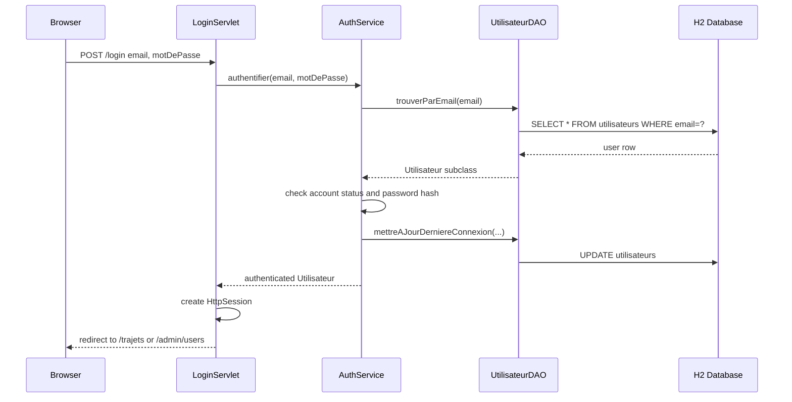

Key classes:

- `LoginServlet`
- `AuthService`
- `UtilisateurDAO`
- `PasswordUtils`

Session key:

```text
utilisateurConnecte
```

### 8.2 Registration Flow

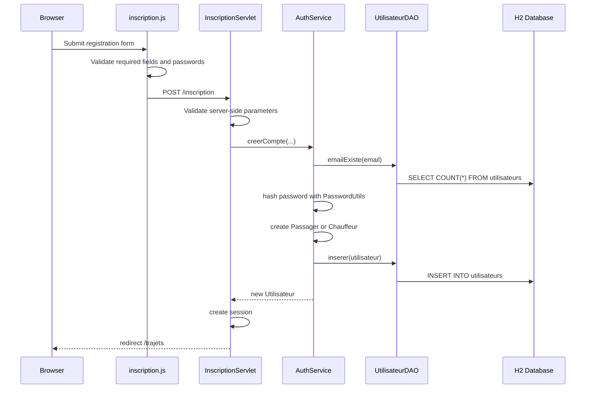

Important detail: users cannot register directly as `ADMIN`. `InscriptionServlet` rejects `ADMIN` as a registration role.

### 8.3 Trip Search Flow

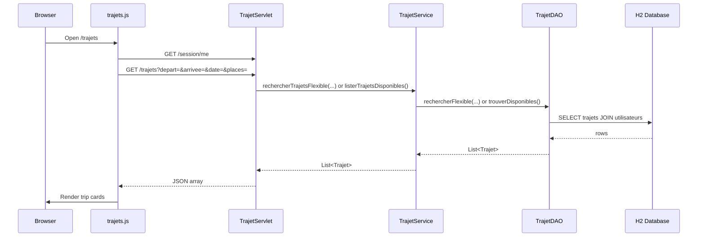

The frontend chooses between initial list and filtered search through query parameters. The backend detects JSON requests from the `Accept: application/json` header or `format=json`.

### 8.4 Driver Creates a Trip

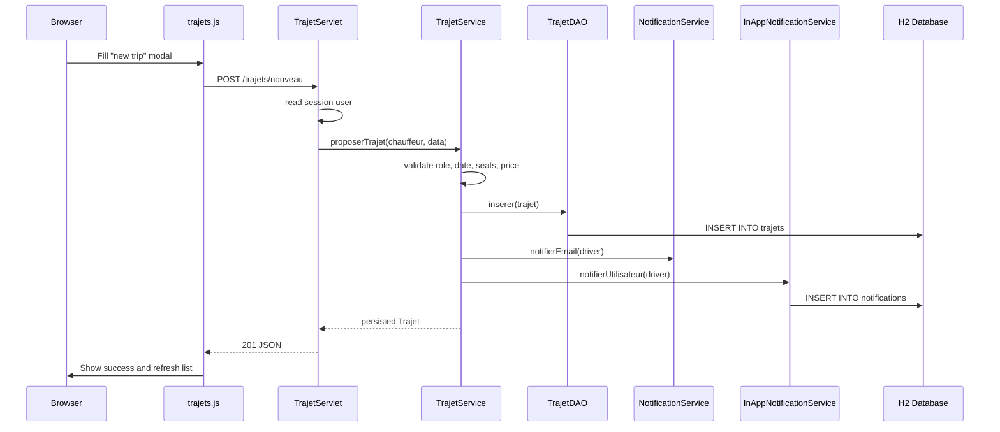

Rules enforced by `TrajetService`:

- user must be active
- user must be `Chauffeur` or `Admin`
- departure must be at least 30 minutes in the future
- seats must be between 1 and 8
- price must be between 0 and 500

### 8.5 Passenger Creates a Reservation

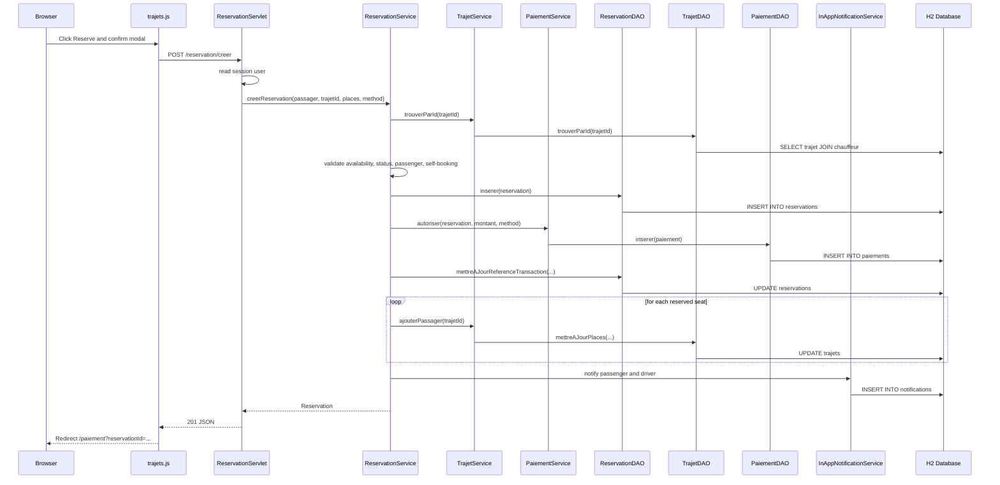

Important business rules:

- user must be logged in and active
- trip must exist
- trip must be `OUVERT`
- requested seats must be available
- a driver cannot reserve their own trip
- reservation starts as `EN_ATTENTE`
- payment is authorized immediately
- real payment capture happens when the driver confirms the reservation

### 8.6 Driver Confirms a Reservation

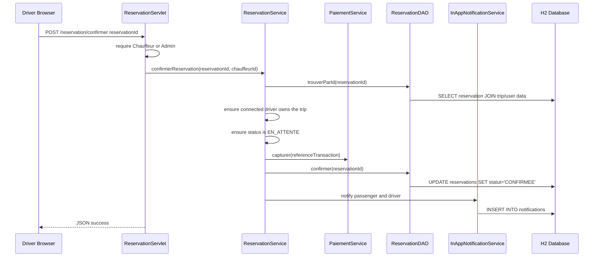

### 8.7 Passenger Cancels a Reservation

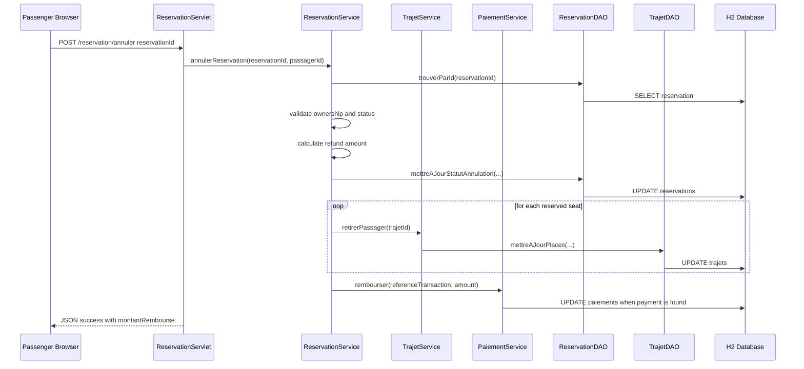

Refund rule:

- more than 24 hours before departure: full refund
- 24 hours or less before departure: 50 percent refund

### 8.8 Driver Cancels a Trip

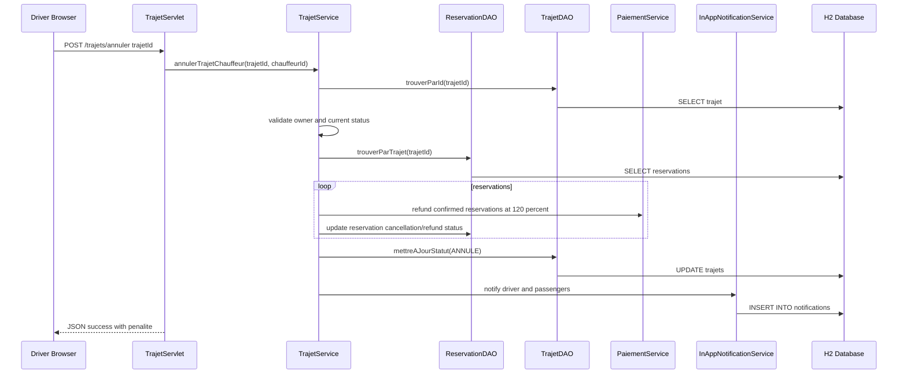

Penalty behavior:

- confirmed reservations are refunded at 120 percent
- the extra 20 percent is treated as the driver penalty
- pending reservations are cancelled without refund

### 8.9 Notification Flow

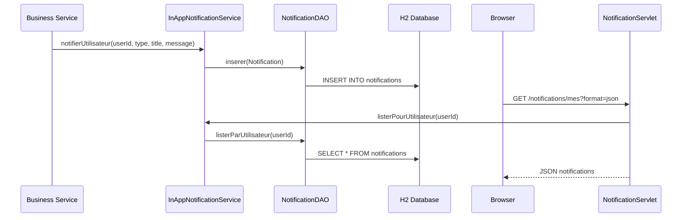

## 9. Service Connection Map

This is the most important service dependency picture:

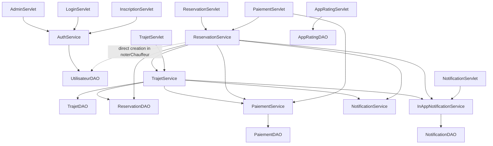

Notes:

- `ReservationService` is the most connected service because reservation creation affects trips, payments, and notifications.
- `TrajetService` also coordinates several services because trip cancellation can affect many reservations and payments.
- `NotificationService` only logs email/SMS. It does not persist anything.
- `InAppNotificationService` persists notifications through `NotificationDAO`.
- Most services have constructors that accept dependencies. This is useful for testing and is used in `TrajetServiceTest`.

## 10. Route Reference

| Method | Route | Handler | Returns |
| --- | --- | --- | --- |
| GET | `/` | static `index.html` | Home page |
| GET | `/login` | `LoginServlet` | Login page |
| POST | `/login` | `LoginServlet` | Redirect after login |
| GET/POST | `/logout` | `LoginServlet` | Session invalidation and redirect |
| GET | `/inscription` | `InscriptionServlet` | Registration page |
| POST | `/inscription` | `InscriptionServlet` | Creates user and redirects |
| GET | `/session/me` | `SessionServlet` | JSON current user |
| GET | `/trajets` | `TrajetServlet` | HTML page or JSON trip list |
| GET | `/trajets/mes` | `TrajetServlet` | Driver trips page or JSON |
| POST | `/trajets/nouveau` | `TrajetServlet` | JSON created trip |
| POST | `/trajets/annuler` | `TrajetServlet` | JSON cancellation result |
| GET | `/reservation/mes` | `ReservationServlet` | Passenger reservations page or JSON |
| GET | `/reservation/chauffeur` | `ReservationServlet` | Driver reservation JSON |
| GET | `/reservation/eligibles` | `ReservationServlet` | Reservations eligible for driver rating |
| POST | `/reservation/creer` | `ReservationServlet` | JSON created reservation |
| POST | `/reservation/annuler` | `ReservationServlet` | JSON refund result |
| POST | `/reservation/confirmer` | `ReservationServlet` | JSON confirmation result |
| POST | `/reservation/supprimer` | `ReservationServlet` | JSON deletion result |
| POST | `/reservation/noter` | `ReservationServlet` | JSON rating result |
| GET | `/paiement` | `PaiementServlet` | Payment page |
| POST | `/paiement` | `PaiementServlet` | JSON payment result |
| GET | `/notifications` | `NotificationServlet` | Notifications page |
| GET | `/notifications/mes` | `NotificationServlet` | JSON notifications |
| POST | `/notifications/lu` | `NotificationServlet` | Mark one as read |
| POST | `/notifications/lu-tout` | `NotificationServlet` | Mark all as read |
| POST | `/notifications/supprimer` | `NotificationServlet` | Delete notification |
| GET | `/admin/users` | `AdminServlet` | Admin page or JSON users |
| GET | `/admin/bloques` | `AdminServlet` | Blocked users page or JSON |
| POST | `/admin/suspendre` | `AdminServlet` | JSON admin action result |
| POST | `/admin/bloquer` | `AdminServlet` | JSON admin action result |
| POST | `/admin/reactiver` | `AdminServlet` | JSON admin action result |
| POST | `/app/notation` | `AppRatingServlet` | JSON app rating result |

## 11. Security and Session Behavior

### Session

Logged-in users are stored in the HTTP session under:

```java
LoginServlet.SESSION_UTILISATEUR
```

The string value is:

```text
utilisateurConnecte
```

`SessionServlet` reads the same session attribute and returns:

```json
{
  "connecte": true,
  "id": 1,
  "nom": "...",
  "prenom": "...",
  "role": "PASSAGER"
}
```

If no user is connected, it returns HTTP `401` with:

```json
{"connecte":false}
```

### Access Control

Access control is mostly done inside servlets:

- passenger features require any logged-in user
- driver features require `Chauffeur` or `Admin`
- admin features require `Admin`

The project uses `instanceof` checks against concrete model classes instead of only checking role strings. Examples:

- `TrajetServlet.getChauffeurConnecte(...)`
- `ReservationServlet.getChauffeurConnecte(...)`
- `AdminServlet.getAdmin(...)`

### Passwords

`PasswordUtils` hashes passwords with salted SHA-256:

```text
BASE64(salt):BASE64(hash)
```

It also supports an older legacy SHA-256 hex format, used by the seeded admin/demo accounts.

## 12. Error Handling

The application uses a mix of:

- redirects with query parameters for traditional form pages
- JSON error responses for AJAX endpoints
- custom exceptions for business cases

Main custom exceptions:

| Exception | Meaning |
| --- | --- |
| `AuthenticationException` | Email/password/account-status authentication failure. |
| `UtilisateurSuspenduException` | User account is suspended. |
| `ReservationInvalideException` | Reservation action violates business rules. |
| `TrajetCompletException` | Trip has no available seats. |
| `PaiementEcheException` | Payment authorization/capture/refund failed. |

## 13. Testing Approach

There is a JUnit test in:

```text
src/test/java/com/covoiturage/service/TrajetServiceTest.java
```

It tests driver trip cancellation when a confirmed reservation exists:

- the passenger receives a 120 percent refund
- the extra 20 percent is calculated as driver penalty
- the reservation is marked `REMBOURSEE`
- the trip is marked `ANNULE`

The test uses fake DAOs and fake services by extending the real classes and overriding methods. That works because services support constructor injection.

## 14. SOLID Concepts in POO/OOP and Where They Are Used

POO means "Programmation Orientee Objet", or Object-Oriented Programming. SOLID is a set of five design principles that help object-oriented code stay maintainable, testable, and easier to extend.

### S - Single Responsibility Principle

Definition: a class should have one main reason to change.

Where it appears:

| Class | Single responsibility |
| --- | --- |
| `AuthService` | User identity and account state. |
| `TrajetService` | Trip business operations. |
| `ReservationService` | Reservation business operations. |
| `PaiementService` | Payment lifecycle simulation. |
| `NotificationService` | Email/SMS notification simulation. |
| `InAppNotificationService` | Persisted in-app notifications. |
| `UtilisateurDAO`, `TrajetDAO`, `ReservationDAO`, etc. | SQL access for their own data area. |

Example:

`ReservationService` does not directly write SQL for reservations. It delegates persistence to `ReservationDAO`. It also does not implement email formatting infrastructure; it delegates notification sending to `NotificationService` and in-app storage to `InAppNotificationService`.

Limit to notice:

`ReservationService` is still a large orchestration class. It handles reservation creation, cancellation, confirmation, deletion, and driver rating. It follows SRP at the "reservation use case" level, but it could be split further if the project grows.

### O - Open/Closed Principle

Definition: code should be open for extension but closed for modification.

Where it appears:

- `Utilisateur` is abstract.
- `Passager`, `Chauffeur`, and `Admin` extend it.
- Business code can work with the base type `Utilisateur` while subclasses provide role-specific behavior through `getRole()`.

Example:

```java
public abstract class Utilisateur {
    public abstract String getRole();
}
```

The DAO maps database roles into concrete subclasses:

```text
ADMIN -> Admin
CHAUFFEUR -> Chauffeur
PASSAGER -> Passager
```

If another role is added later, the model hierarchy can be extended with another subclass. Some mapping code would still need to be updated, so the project partially follows OCP but is not fully plugin-like.

### L - Liskov Substitution Principle

Definition: subclasses should be usable anywhere their parent type is expected, without breaking behavior.

Where it appears:

- `Admin`, `Chauffeur`, and `Passager` are all valid `Utilisateur` objects.
- Sessions store the connected user as `Utilisateur`.
- Services accept `Utilisateur` and then apply business-specific checks when needed.

Examples:

- `AuthService.authentifier(...)` returns `Utilisateur`, but the actual object may be `Admin`, `Chauffeur`, or `Passager`.
- `SessionServlet` can return common user data without caring about the concrete subclass.
- `TrajetService.proposerTrajet(...)` accepts `Utilisateur` but only allows `Chauffeur` or `Admin`.

Important nuance:

LSP is respected for shared user behavior such as id, email, status, and session identity. Business rules still restrict specific operations by subtype, which is normal for role-based domains.

### I - Interface Segregation Principle

Definition: clients should not be forced to depend on methods they do not use.

Where it appears partially:

- The project separates responsibilities by class instead of creating one huge service interface.
- `AuthService`, `TrajetService`, `ReservationService`, and `PaiementService` expose only methods relevant to their business area.
- DAOs are separated by entity/table instead of one large universal DAO.

Limit to notice:

There are no Java interfaces such as `PaymentGateway`, `NotificationSender`, or `UserRepository`. The project uses concrete classes. This is fine for a small demo, but if it grows, interfaces would improve ISP and make tests cleaner.

Potential improvement:

```java
public interface PaymentGateway {
    String autoriser(Reservation reservation, double montant, MethodePaiement methode);
    void capturer(String reference);
    void rembourser(String reference, double montant);
}
```

Then `PaiementService` or an external Stripe implementation could be swapped without changing reservation logic.

### D - Dependency Inversion Principle

Definition: high-level business code should depend on abstractions, not low-level details.

Where it appears:

- Several services support constructor injection:
  - `AuthService(UtilisateurDAO utilisateurDAO)`
  - `PaiementService(PaiementDAO paiementDAO)`
  - `ReservationService(...)`
  - `TrajetService(...)`
- `TrajetServiceTest` injects fake DAOs and fake services to test business behavior without a real database.

Example from the test design:

```text
TrajetService
  receives FakeTrajetDAO
  receives FakeReservationDAO
  receives RecordingPaiementService
  receives NoopNotificationService
  receives NoopInAppNotificationService
```

This is dependency injection, which supports DIP and testability.

Limit to notice:

The services still depend on concrete DAO classes, not interfaces. Also, default constructors instantiate concrete dependencies with `new`. This is practical for a servlet demo but not pure DIP.

## 15. OOP Concepts Used in the Project

### Encapsulation

Model fields are private and accessed through getters/setters:

- `Utilisateur`
- `Trajet`
- `Reservation`
- `Paiement`
- `Notification`

Business methods protect invariants:

- `Trajet.reserverPlace()`
- `Trajet.libererPlace()`
- `Reservation.confirmer()`
- `Reservation.annuler()`
- `Paiement.capturer()`
- `Paiement.rembourser(...)`

### Inheritance

`Utilisateur` is the parent class of:

- `Passager`
- `Chauffeur`
- `Admin`

This models shared identity plus role-specific behavior.

### Polymorphism

The application stores and passes users as `Utilisateur`, while runtime behavior depends on actual subtype.

Examples:

- `getRole()` returns a different role string depending on subclass.
- `instanceof Chauffeur`, `instanceof Admin`, and `instanceof Passager` decide allowed actions.
- `UtilisateurDAO.mapperResultSet(...)` returns the correct concrete subclass based on database role.

### Abstraction

Services abstract business use cases from servlets. DAOs abstract SQL from services.

Example:

`ReservationServlet` does not know the SQL needed to create a reservation. It only calls:

```java
reservationService.creerReservation(...)
```

The service coordinates DAOs and payment/notification services behind that one operation.

### Composition

Domain objects contain other domain objects:

- `Reservation` has a `Trajet`
- `Reservation` has a `Passager`
- `Trajet` has a `Chauffeur`
- `Paiement` has a `Reservation`

Services also compose other services and DAOs:

- `ReservationService` composes `TrajetService`, `PaiementService`, and notification services.
- `TrajetService` composes payment and notification services for trip cancellation effects.

## 16. Summary

This project is a small but complete layered Java web application:

1. The frontend is static HTML/CSS/JS.
2. JavaScript uses `fetch()` for JSON APIs and forms for classic POST flows.
3. Servlets handle HTTP, sessions, redirects, and JSON.
4. Services implement business rules.
5. DAOs isolate SQL and database mapping.
6. H2 stores users, trips, reservations, payments, notifications, and app ratings.
7. OOP is used through encapsulated domain entities, inheritance for user roles, polymorphic role handling, and service/DAO composition.
8. SOLID is present most clearly through SRP and dependency injection, partially through OCP/LSP/ISP/DIP, with room to improve by introducing interfaces for repositories, notifications, and payment gateways.
